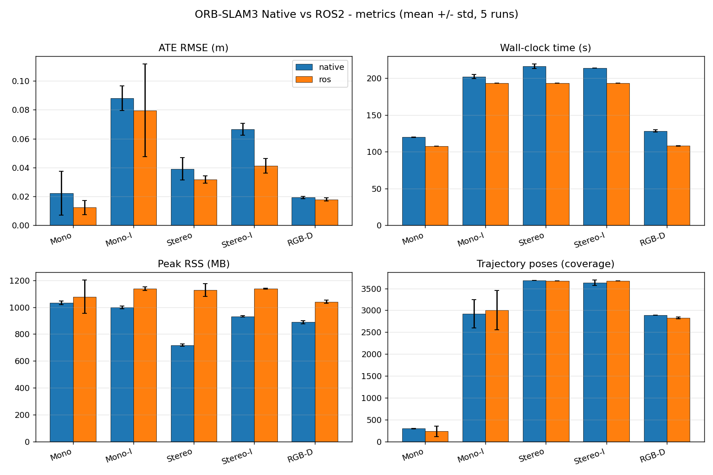
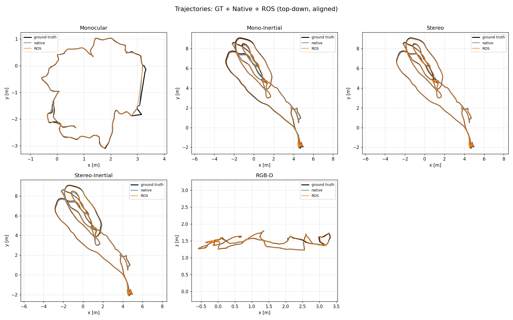

# ORB-SLAM3 ROS2 Wrapper 

A ROS2 (Humble) wrapper around ORB-SLAM3. A single `ros_node` selects the sensor
modality at runtime via the `sensor_type` parameter and is driven by rosbag
playback: camera intrinsics come from `CameraInfo`, extrinsics from `tf_static`,
and stereo/RGB-D pairs are synchronised with `message_filters` ApproximateTime.

This document reports a head-to-head benchmark of this wrapper against the
native upstream ORB-SLAM3 examples (which read dataset files directly), across
five sensor modalities, 5 runs each, with mean ± standard deviation.

## Packages
| package | role |
|---|---|
| `orb_slam3` | vendored ORB-SLAM3 core (Pangolin viewer stripped) |
| `orb_slam3_dbow2`, `orb_slam3_g2o` | vendored DBoW2 / g2o |
| `orb_slam3_ros` | the ROS2 node (`ros_node`), launch files, configs |

```bash
colcon build --symlink-install
ros2 launch orb_slam3_ros euroc.launch.py        # stereo-inertial (EuRoC)
ros2 launch orb_slam3_ros tum_rgbd.launch.py     # RGB-D (TUM)
ros2 launch orb_slam3_ros tum_mono.launch.py     # monocular (TUM)
# then: ros2 bag play <bag> --rate 1.0
```

---

## Benchmark setup

| modality | dataset / sequence | native binary | ROS launch / `sensor_type` |
|---|---|---|---|
| Monocular | TUM RGB-D `fr2_desk` | `mono_tum` | `tum_mono` / `monocular` |
| Mono-Inertial | EuRoC `MH_01_easy` | `mono_inertial_euroc` | `euroc_mono` / `monocular_imu` |
| Stereo | EuRoC `MH_01_easy` | `stereo_euroc` | `euroc_stereo` / `stereo` |
| Stereo-Inertial | EuRoC `MH_01_easy` | `stereo_inertial_euroc` | `euroc` / `stereo_imu` |
| RGB-D | TUM RGB-D `fr2_desk` | `rgbd_tum` | `tum_rgbd` / `rgbd` |

Out of all modalities RGB-I is excluded as theres is no native build. The native examples were
built with the Pangolin viewer **disabled** to match the viewer-stripped ROS core,
so timing/memory are comparable. Trajectories are evaluated with `evo` (ATE RMSE;
Sim3 alignment for monocular, SE3 otherwise) against dataset ground truth.

> This is a very crude test: identical performance with native version is expected but not guaranteed. 

---

## Results

### Accuracy — ATE RMSE (lower is better)

| Modality | Native | ROS |
|---|---|---|
| Monocular | 22 ± 15 mm | **12 ± 5 mm** |
| Mono-Inertial | 88 ± 9 mm | **79 ± 32 mm** |
| Stereo | 39 ± 8 mm | **32 ± 3 mm** |
| Stereo-Inertial | 67 ± 4 mm | **41 ± 5 mm** |
| RGB-D | 19 ± 1 mm | **18 ± 1 mm** |

### Frame coverage — trajectory poses (higher = fewer dropped frames)

| Modality | Native | ROS |
|---|---|---|
| Monocular | 295 ± 3 | 231 ± 116 |
| Mono-Inertial | 2919 ± 326 | 3008 ± 451 |
| Stereo | 3682 ± 0 | 3677 ± 1 |
| Stereo-Inertial | 3628 ± 61 | 3673 ± 3 |
| RGB-D | 2893 ± 0 | 2829 ± 22 |

### Peak memory (lower is better)

| Modality | Native | ROS |
|---|---|---|
| Monocular | 1033 ± 12 MB | 1077 ± 124 MB |
| Mono-Inertial | 999 ± 10 MB | 1138 ± 12 MB |
| Stereo | 718 ± 7 MB | 1128 ± 48 MB |
| Stereo-Inertial | 932 ± 5 MB | 1138 ± 3 MB |
| RGB-D | 889 ± 12 MB | 1040 ± 12 MB |

### Wall-clock time (both real-time bounded by sequence length)

| Modality | Native | ROS |
|---|---|---|
| Monocular | 120 ± 0.2 s | 108 ± 0.1 s |
| Mono-Inertial | 202 ± 3 s | 193 ± 0.1 s |
| Stereo | 216 ± 3 s | 193 ± 0.1 s |
| Stereo-Inertial | 214 ± 0.1 s | 193 ± 0.1 s |
| RGB-D | 128 ± 2 s | 108 ± 0.04 s |

### ROS Failure Mode

Monocular: 4/5 runs succeeded — one run failed to initialise, due to hard realtime constraint imposed by ROS. 

### Native Failure Mode

Mono-Inertial: 67 ± 17 map resets/run during IMU initialisation
  (a native-example quirk)

### Figures
**Metrics (mean ± std, 5 runs):**


**Trajectories (GT + native + ROS, top-down, aligned):**



### Summary
- ROS version matches native performance, within random noise.
- ROS have noticeably higher memory usage and some dropped frames from real-time, sync-driven data delivery.
- Robustness is comparable, with a slight edge to native on fragile monocular init.
